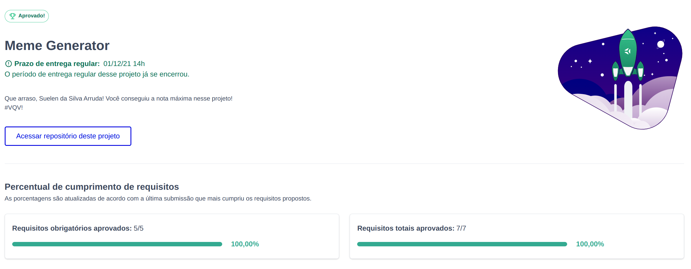

# :heart_eyes: Week Challenge 5-5  :heart_eyes:

## Meme Generator Project

 E, finalmente, consegui terminar o desafio!!! 5 projetos de manipulação de dom em uma semana!!! Nesse projeto foi desenvolvido um site que é possível fazer upload de uma imagem e colocar alguma frase, gerando um meme. 

 

#### Você pode conferir os outros projetos aqui:
<ul>
<li><a href="https://github.com/onyrius/challenge1">challenge 1: Guess Color Project</a></li>
<li><a href="https://github.com/onyrius/challenge2">challenge 2: Mistery Letter Project</a></li>
<li><a href="https://github.com/onyrius/challenge3">challenge 3: Pixel Art Project</a></li>
<li><a href="https://github.com/onyrius/challenge4">challenge 4: Guess Color Project</a></li>
</ul>

 

## Habilidades

- Manipular o DOM.

- Manipular o Javascript.

- Manipular o CSS.

---

 

## Desenvolvimento

- Devolvido um site usando HTML, CSS e JAVASCRIPT, onde é possível fazer o upload de fotos para memes .

---

 

## Stack utilizada

  
  
 

 

## Status do projeto

## 🔗 Links

